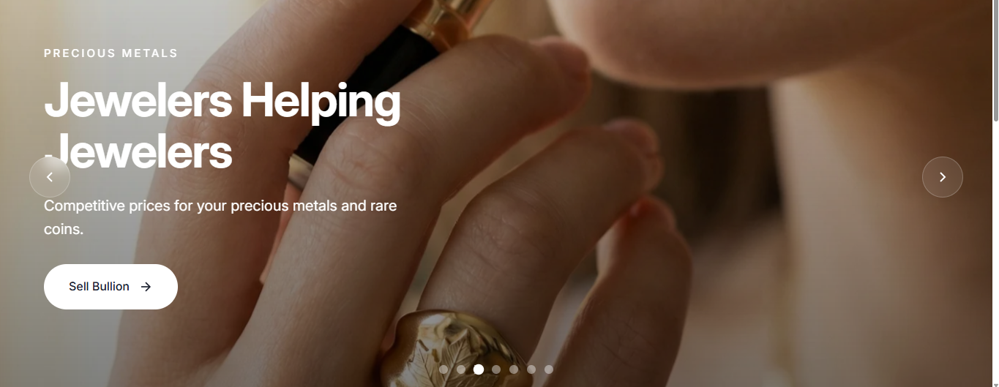
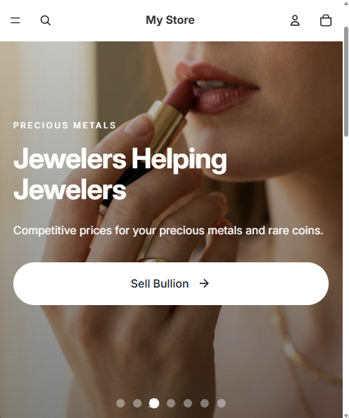
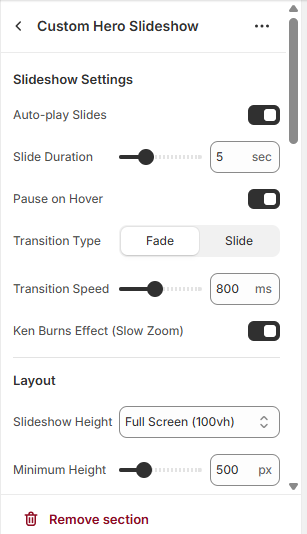

# Shopify Luxury Hero Slideshow

A high-performance, fully customizable hero slideshow section for Shopify themes. Built for luxury brands and premium e-commerce stores with smooth animations and extensive configuration options.


---

## Features

### Animation and Effects
- Ken Burns Effect with configurable zoom animation
- Smooth fade transitions between slides
- Staggered text animations with sequential content reveal
- Animated progress indicators on navigation dots

### Responsive Design
- Native touch and swipe support for mobile devices
- Keyboard navigation with arrow keys
- Fully responsive across all screen sizes
- Dynamic viewport height handling (100dvh support)

### Customization Options
- Unlimited slides with individual settings
- Gradient overlays with directional control
- Three button styles: Primary, Secondary, White
- Full typography control including size, color, and alignment
- Configurable autoplay with pause on hover

### Performance
- Lazy loading for non-visible slides
- Visibility API integration (pauses when tab inactive)
- Optimized image srcset for bandwidth efficiency
- Clean, minimal JavaScript footprint

---

## Preview

| Desktop View | Mobile View | Customizer |
|:------------:|:-----------:|:----------:|
|  |  |  |

---

## Installation

### Step 1: Download
Download `hero-slideshow.liquid` from this repository.

### Step 2: Upload to Shopify
Navigate to your Shopify Admin:
```
Online Store > Themes > Actions > Edit Code
```

1. Open the **Sections** folder
2. Click **Add a new section**
3. Name it `hero-slideshow`
4. Replace the default code with the contents of `hero-slideshow.liquid`
5. Save the file

### Step 3: Add to Theme
Open the Theme Customizer:
```
Online Store > Themes > Customize
```

1. Click **Add Section**
2. Select **Luxury Hero Slideshow**
3. Configure your slides and settings
4. Save changes

---

## Configuration

### Slideshow Settings

| Setting | Description | Default |
|---------|-------------|---------|
| Auto-play | Automatically advance slides | Enabled |
| Slide Duration | Time per slide in seconds | 5 |
| Pause on Hover | Stop autoplay on mouse hover | Enabled |
| Transition Speed | Animation duration in milliseconds | 800 |
| Ken Burns Effect | Slow zoom animation on images | Enabled |

### Layout Options

| Setting | Description | Options |
|---------|-------------|---------|
| Height | Slideshow viewport height | 70vh, 80vh, 90vh, 100vh |
| Min Height | Minimum height in pixels | 400 - 800 |
| Content Width | Maximum width of text container | 400 - 800 |

### Navigation

| Setting | Description |
|---------|-------------|
| Show Arrows | Display left/right navigation arrows |
| Show Dots | Display bottom dot indicators |
| Dot Progress | Show animated progress circle on active dot |
| Scroll Indicator | Display scroll prompt at bottom |

### Overlay Configuration

| Setting | Description |
|---------|-------------|
| Overlay Color | Base color for gradient overlay |
| Top Opacity | Transparency at gradient start (0-90%) |
| Bottom Opacity | Transparency at gradient end (0-90%) |
| Direction | Gradient direction (top, bottom, left, right) |

### Slide Settings

Each slide supports individual configuration:

| Setting | Description |
|---------|-------------|
| Enable Slide | Toggle slide visibility |
| Background Image | Hero image for slide |
| Image Alt Text | Accessibility description |
| Subheadline | Small text above headline |
| Headline | Main title text |
| Description | Supporting paragraph text |
| Text Alignment | Left, Center, or Right |
| Button Text | Call-to-action label |
| Button Link | Destination URL |
| Button Style | Primary, Secondary, or White |

---

## Image Guidelines

For optimal results:

- **Resolution:** Minimum 2000px width, 16:9 aspect ratio recommended
- **Format:** JPEG for photographs, WebP for better compression
- **File Size:** Keep under 500KB for fast loading
- **Composition:** Center important content for mobile crop safety

---

## Color Schemes

### Dark Luxury
```
Overlay Color: #000000
Top Opacity: 20%
Bottom Opacity: 50%
Text Color: #FFFFFF
```

### Warm Elegant
```
Overlay Color: #1A1F2E
Top Opacity: 10%
Bottom Opacity: 40%
Accent: #C9A962
```

### Light Minimal
```
Overlay Color: #FFFFFF
Top Opacity: 0%
Bottom Opacity: 30%
Text Color: #1A1F2E
```

---

## Browser Support

| Browser | Status |
|---------|--------|
| Chrome | Supported |
| Firefox | Supported |
| Safari | Supported |
| Edge | Supported |
| Mobile Safari | Supported |
| Chrome Mobile | Supported |

---

## Changelog

### Version 1.0.0
- Initial release
- Ken Burns zoom effect
- Fade transitions with configurable speed
- Autoplay with pause on hover functionality
- Touch and swipe gesture support
- Keyboard navigation
- Progress indicators
- Gradient overlay system
- Three button style variants
- Full mobile responsiveness
- Visibility API integration
- Lazy loading implementation

---

## License

MIT License - Free for personal and commercial use.

---

## Author

**Rochdi**

Shopify Developer

---

